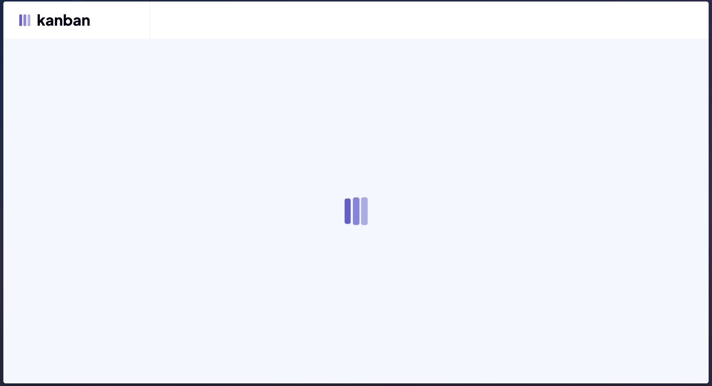
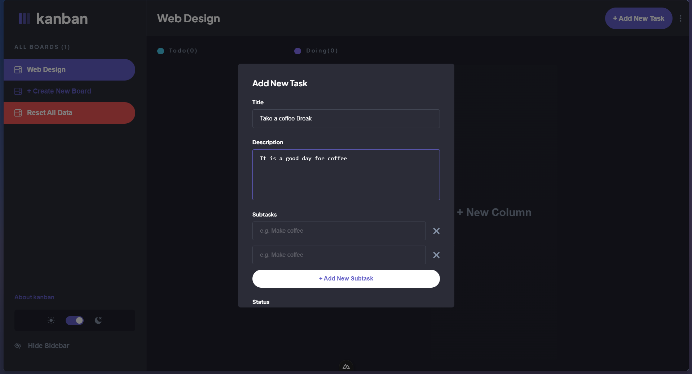
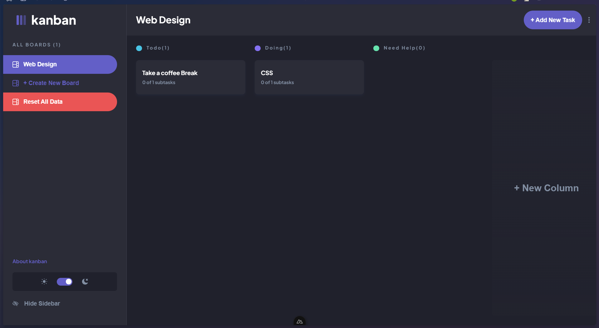

# Development Mode

To start the application in development mode, run:

### Using npm:

```bash
npm run dev
```

### Or using Yarn:

```bash
yarn dev
```

This will start the development server at [http://localhost:3000](http://localhost:3000). Any changes you make to your files will automatically reload the application.
```






